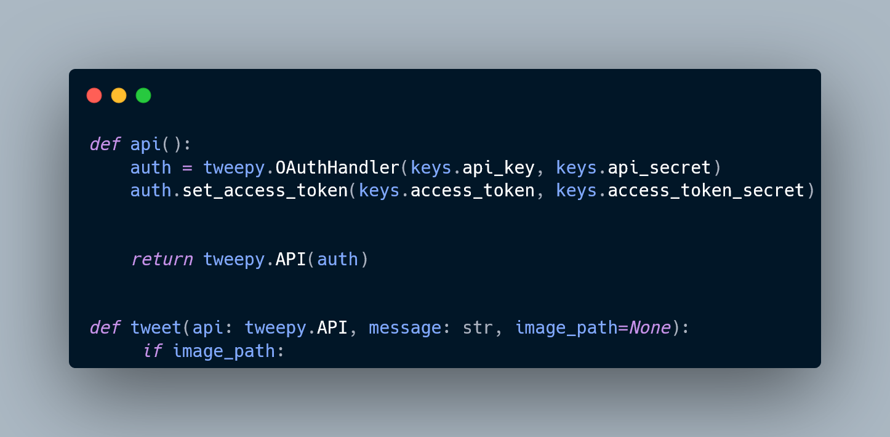

# Python Program

[](https://www.python.org/downloads/release/python-390/)

## Description
This is a Python program for building a basic Twitter bot to tweet.

## Installation
1. Make sure you have Python 3.9 installed. You can download it from [here](https://www.python.org/downloads/release/python-390/).
2. Clone this repository:

   ```shell
   git clone https://github.com/AlirezaRafiyian/TwitterBot.git

I. Navigate to the project directory:
  cd your-repository

II. Install the required dependencies:
  pip install -r requirements.txt
** Do not forget to get the Token from developer Twitter.
